# Adding LUIS

## Let's make our Bot smart!

### Let's take a step back from coding right now and think about the product we want to create.
### Right now, our bot has a very limited understanding. It can only understand a few commands and that doesn't work very well for users who want to have a normal conversation. Conversation is messy and hard to predict.

### **Enter LUIS, Microsoft's new Natural Language Processing Service.**

### 1. To get started with LUIS, navigate to <https://luis.ai> in your browser.

### 2. Log in using your Microsoft Account. If this is the first time you have logged in your will have to answer some simple questions.
You will be presented with a web page titled LUIS: My Applications

 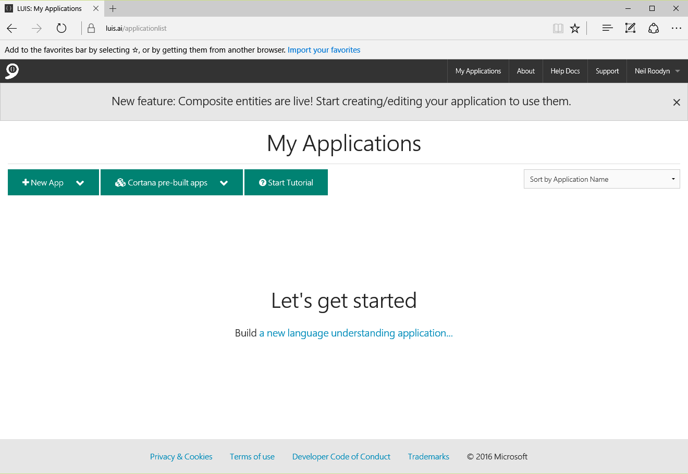   
   Figure 1 LUIS Applications Page 

### 3. Click on the New App button and select 'New Application' from the menu.

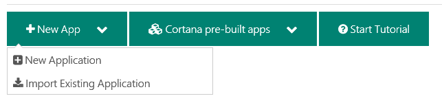   
   Figure 2 Create a new application 

### 4. In the *Add a New Application* dialog give your app a **name** and set the usage scenario as **Bot** . You can select application domains and make sure the culture is set to one that works for you. You will need to select a domain, select Shopping. Click on the **Add App** button in the bottom right corner.

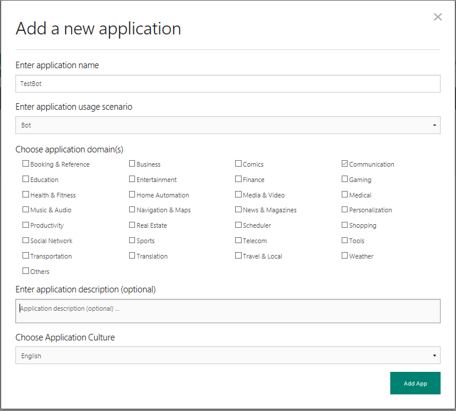   
   Figure 3 Add application information 

### 5. You will now see a page for your app. Here you can create a language model to train the service about your application. First you will create an intent. An intent is an action that you would like your customers to be able to trigger through a natural language command. You will start with the OrderFood action.
Click on the Add Intents button, show in figure 4.

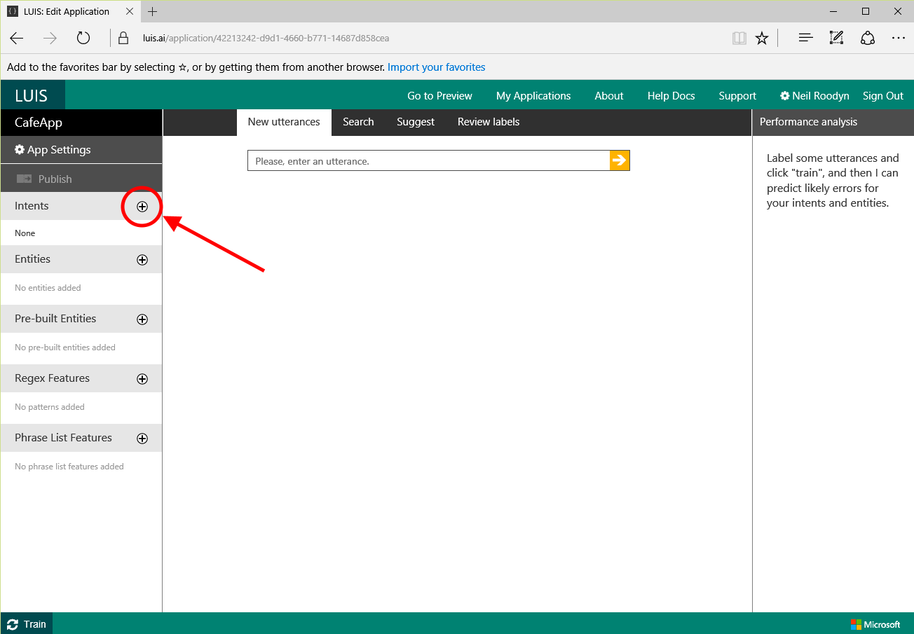   
   Figure 4 Add Intent 
 
 
 
 
 
 
 
 
## ADD LUIS MODEL BUILDING HERE
 
 
 
 
 
 
 
 

### 16. In order to use the LUIS app from your Bot you will need an Azure subscription key. It is assumed you have an Azure account. If not you can sign up for a trial account. You are allowed one free LUIS model even if you have exhausted your free trial so don't worry about pricing here.
### To create a new subscription key for your LUIS service Sign in to the [Azure Portal](https://ms.portal.azure.com/) In the top left side of the page click the New link.

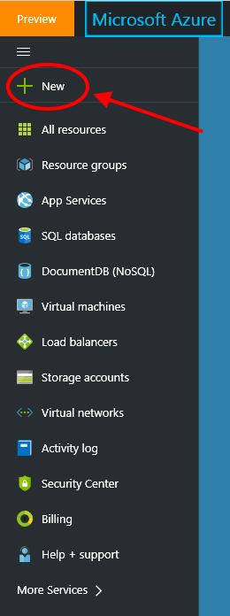
   Figure 14 A a new Azure resource

### 17. In the search box enter *Cognitive Services* and select the Cognitive Services APIs, then click the Create button to create 

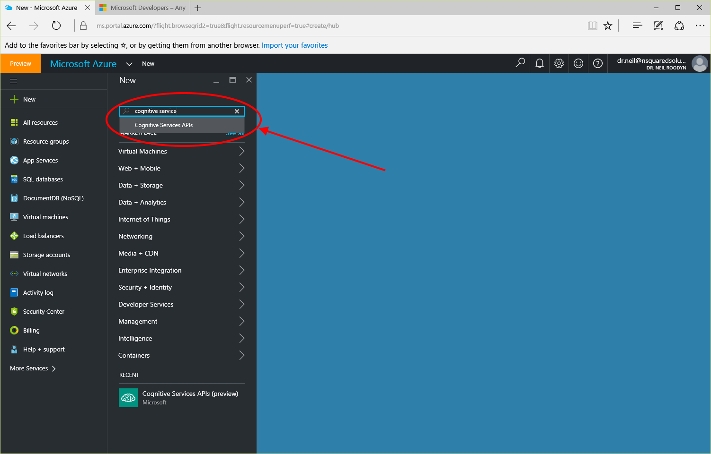
   Figure 15 Find the Cognitive Services APIs

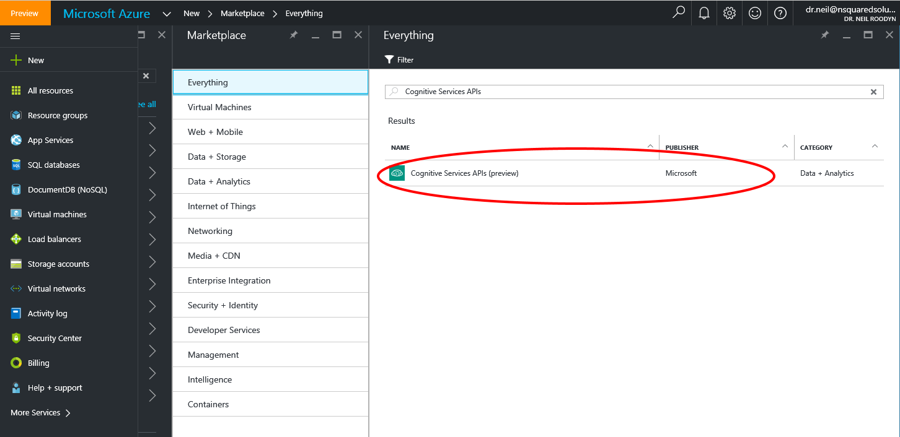
   Figure 16 Select the Cognitive Services APIs

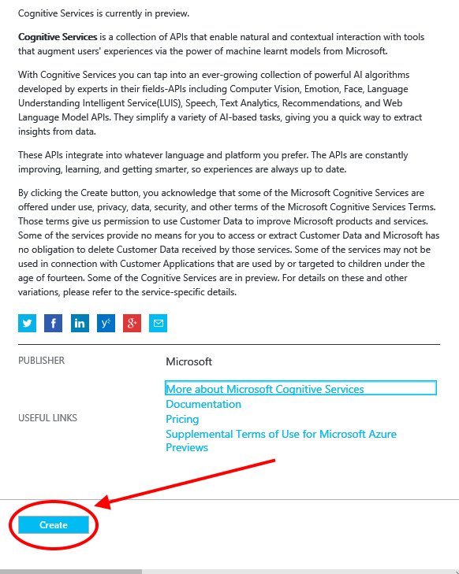
   Figure 17 Create the Cognitive Services 

### 18. On the Create page, enter a name for the service, this is be for you to identify, then select the API type. You need to select the LUIS API.

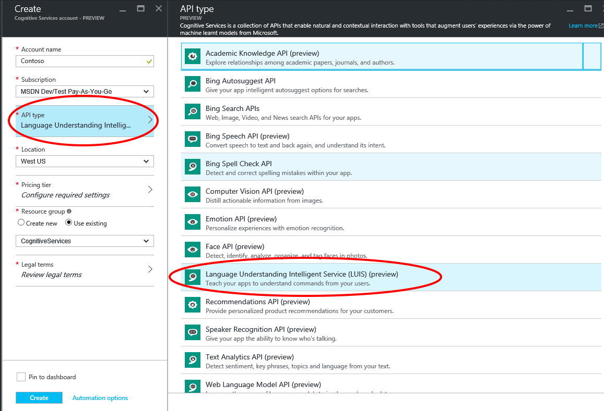
   Figure 18 Select the LUIS API 

### 19. Select a pricing tier, The free tier is fine for this exercise. Then select the legal terms and ensure you agree. Then you can click on **Create**. 

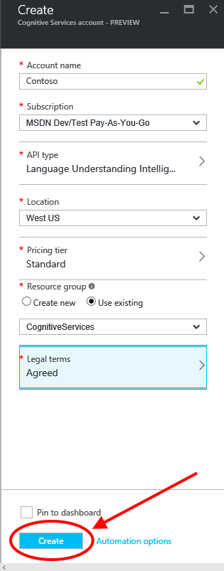
   Figure 19 Create the LUIS service 

### 20. You now need to find the service you created and get a subscription key to use with your LUIS app. In the Azure Portal search your resources for the service you just created. Then select the **All Settings** button and then click on the **Keys**. You should see you have two keys, copy the first key to your clipboard, you will need that shortly.

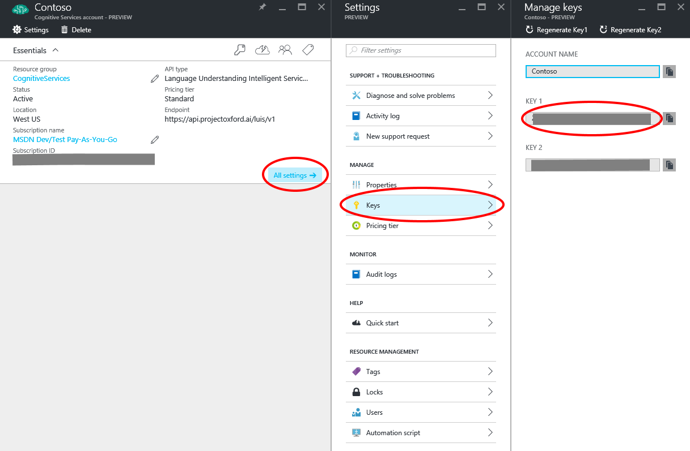
   Figure 20 Get an Azure Subscription Key

### 21. Return to the LUIS portal and under your name in the top right you will see **My Settings**. Click on **My Settings** and then click on the **Subscription Keys** button. You will now see a location to enter the subscription key you copied from the Azure portal. Paste the key into the text box and select **Add Key**
Key a copy of this key somewhere handy, you will need it again soon.

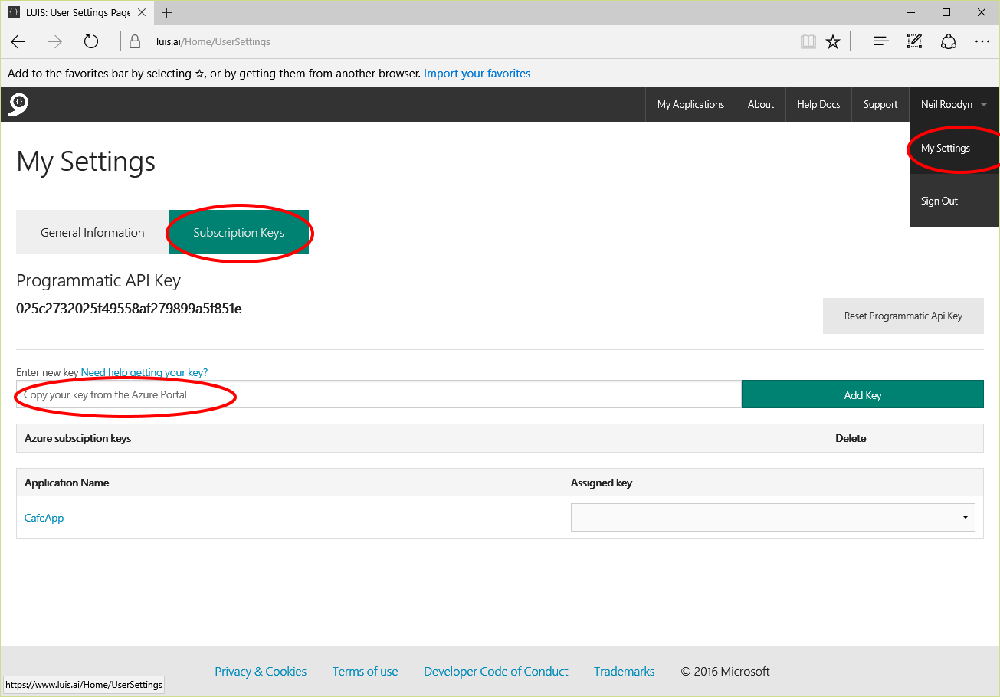
   Figure 21 Enter the Azure Subscription Key into the LUIS Portal

### 22. You will also need the  App ID of your LUIS app to use in the code you are going to add to your Bot. Still in the LUIS Portal select your application and in the top left of the page click on **App Settings**. A dialog will display the App Id for your app, make a copy of this also, you will need it again soon.
