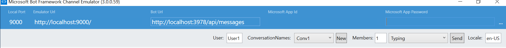
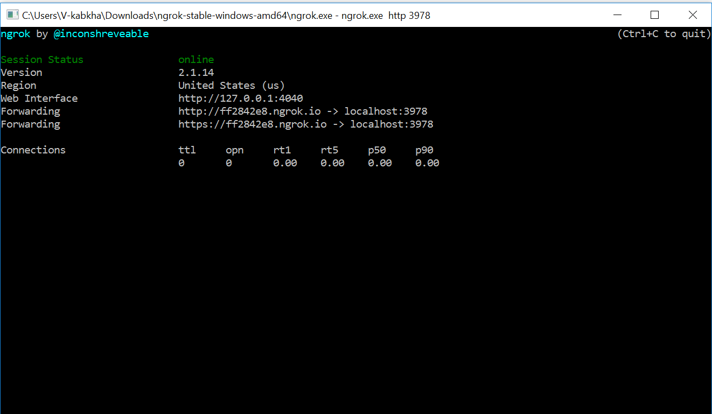
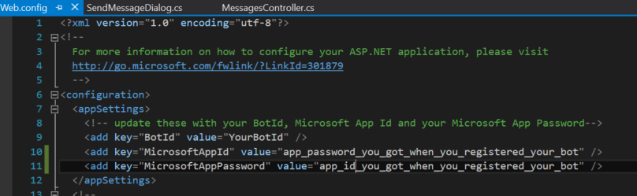
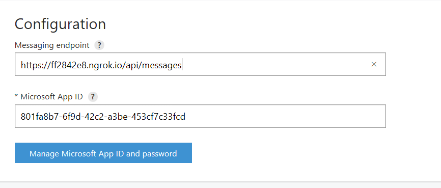
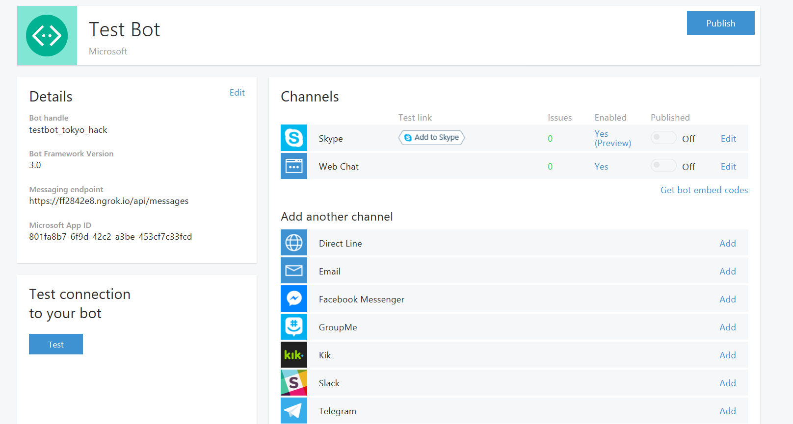

# Getting Started with the Microsoft Bot Framework

### The Microsoft Bot Framework provides a platform for you to build interactive conversational Bots. The Bots you build can support multiple end points, or channels. A channel is the way people will engage with the Bot you build. Examples of channels are Skype, SMS, Slack, Kik, and Facebook Messenger. 

### This tutorial is meant to get you started with a Bot in NodeJS or .NET quickly with the goal of publishing a bot that can understand how to Send Text Messages to Skype.

> ### **Notes:**
> 1. Some steps in this tutorial ask you to follow different steps depending on your operating system (Windows or macOS and Linux). If not specified, the step should work on either operating system. 
> 2. Some steps are split into NodeJS and .NET. If this is the case, it means that your operating system doesn't matter.
 
</br>

# Prerequisites

1. Install Git: Go to <https://git-scm.com/downloads> and download the installer for your Operating System. Follow the steps to install git. 
2. We'll need some Bot Framework specific tools. In your browser navigate to <https://docs.botframework/en-us/downloads>. This page has links and instructions for the tools we need to build our bot. </br> We will refer to this page as the **docs** from now on.
3. First, we need a way to test our bot. From the docs install the bot framework for your Operating System.
    
    * **Windows**:
        1. Under tools click the link for [Bot Framework Emulator (Windows)](https://download.botframework.com/bf-v3/tools/emulator/publish.htm)
        2. From this page click install and you will be prompted to install the Bot Emulator application.
    
    * **macOS or Linux**: 
        1. Under tools click the link for [Bot Framework Emulator (Console)](https://aka.ms/bfemulator). This wil give you a .zip file.
        2. Unzip this file.
        3. Install [Mono](http://www.mono-project.com/download/#download-mac). Select your operating system and click Download.
        4. In your terminal type > $ mono BFEmulator.exe
4. Our ultimate goal is to get our chatbot working on Skype so you will need a Skype account. Go to <https://www.skype.com/> and sign up for an account. Also download the desktop app.
5. To allow our Bot to work on Skype without deploying it to Azure, we need a third party tool called ngrok. Go to <https://ngrok.com/download> and follow the steps to download it.

---
### Great! We now have the tools to get us started with the Bot Framework.

### Now choose an SDK to work with. The Bot Framework currently supports .NET and NodeJS SDKs.

> ### **Note:** If you plan on using the .NET SDK, while not required, the docs will assume you are running Visual Studio on Windows.

6. Choose an SDK to work with and make sure you have the necessary tools to work with that framework.
    
    * **NodeJS**:
        1. Go to <https://nodejs.org/en/download> and download the installer for your operating system. Follow the installer steps to get node. You should install Node version 4 or higher.
        
        2. Feel free to use any text editor you'd like although we recommend [Visual Studio Code](https://code.visualstudio.com).
    
    * **.NET**: 
        1. **VERY IMPORTANT TO DO BEFORE THE HACK STARTS:** </br> Install Visual Studio 2015 (latest update), you can download the community version here for free: <https://www.visualstudio.com> 
        </br> **Important:** Please update all VS extensions to their latest versions Tools->Extensions and Updates->Updates
        
        2. Download and install the Bot Application template. Download the file from the direct download link [here](http://aka.ms/bf-bc-vstemplate).
            </br>Save the zip file (do not extract the contents) to your Visual Studio 2015 templates directory which is traditionally in "%USERPROFILE%\Documents\Visual Studio 2015\Templates\ProjectTemplates\Visual C#\"
            </br></br>
            **Note:** This step isn't necessary as we will be cloning a Quickstart template but it will allow you to make a new bot in the future so it's worth doing.

</br>


# Creating a basic Bot

### **1. First, Download the Quickstart project for the SDK you will be working with.**

### If you're using NodeJS: 

Clone this repo
```
    git clone https://github.com/Microsoft-DXEIP/bot-quickstart-js.git
```
Install Node modules
```
    npm install
```
In the project folder create a file named .env and add the following to it.
```
    PORT = 3978
```
We will be adding these values shortly.
### If you're using C# .NET: 

Clone this repo
```
    git clone https://github.com/Microsoft-DXEIP/bot-quickstart-NET.git
```

### You can also find these repositories by following the links below.
### [NodeJS Repsitory](https://github.com/Microsoft-DXEIP/bot-quickstart-js) | [.NET Repository](https://github.com/Microsoft-DXEIP/bot-quickstart-NET)


### **2. In your favorite browser, go to <https://luis.ai> and sign up for a new account.**

### **3. After signing up, go to the My Applications Tab of the website and click on Cortana Pre-Built Application and choose a language to continue with.** 

### **4. A window will pop up at this point.**
* **NodeJS**:
    1. Copy the URL from this window except for the trailing "&q="
    2. In the Quick Start Project open the .env file and add the url for the key LUIS_MODEL
    ```
        PORT = 3978
        LUIS_APP_MODEL = url_for_the_built-in_cortana_model_without_the_trailing_&q=
    ```

    
* **.NET**: 
    1. Copy the id and subscription key from the url in this popup window. These are in the URL parameters that look like (&id=YOUR_ID) and (&subscription_key=YOUR_KEY)
    2. In the Quick Start Project open the file SendMessageDialog. Replace this line with your values
    ```java
        ...
        [LuisModel("YOUR_LUIS_APP_ID", "YOUR_LUIS_APP_KEY")]
        ...
    ```

### **5. Run the quickstart on localhost**
* **NodeJS**
    1. Open a terminal and change your directory to the quickstart project directory
    2. Run the app with:
    ```
    npm run watch
    ``` 
* **.NET**
    1. Inside Visual Studio, Run the project in Debug mode by pressing F5.

### **6. Start a conversation**
* **Windows**

    1. Open the Bot Framework Channel Emulator App and make sure your Bot URL is set to <http://localhost:3978/api/messages> and the App Id and App Password are blank
    Your emulator configuration should look like this:

    

* **macOS or Linux**
    1. Navigate to where you downloaded the bot framework console emulator and run the BotEmulator.exe
    ```
    /Path/To/BFEmulator/BotFrameworkEmulator-Console $ mono BFEmulator.exe  
    ```

### Test your bot by asking it to send a message. Type something like "Tell John I'll be 5 minutes late for our meeting."
### **We now have our bot working on localhost. In the next few steps we will connect our bot to Skype using ngrok.**


# Connecting to Skype
>### **Note:** For a production app we would deploy our bot to Azure, however we are using ngrok to make things quicker and easier for the tutorial. Once you bind the localhost port to ngrok, don't restart ngrok or your url will change.

### **1. With your app still running on localhost, bind the localhost deployment with ngrok. We will need this URL for registering our bot.**

* **Windows** 
    1. Open the ngrok.exe program you installed in the Prerequisites. (Should open a command prompt window)
    2. Start ngrok on the port your bot is currently running on (The quick start project is running on port 3978): 
    ```
    /Path/To/Extracted/ngrok> ngrok.exe http 3978
    ```

* **macOS or Linux**:
    1. Navigate to the folder you downloaded ngrok to.
    2. Open a terminal and start ngrok on the port your bot is currently running on (The quick start project is running on port 3978):
    ```
    /Path/To/Extracted/ngrok $ ./ngrok http 3978
    ```

You should get something that looks like this. NGrok has created a new URL hosting your localhost deployment.

 
### **2. Now it's time to register our bot with the bot framework. Go to <https://dev.botframework.com/bots/new> to start registering your bot.**

### **3. Click the button that says Create Microsoft AppId and Password and follow the steps to create a new App Id and Password. Keep track of this password as we will need it for our project.**

### **4. Next we need to add the newly generated Microsoft App Id and Microsoft Password to our project:**
* **NodeJS**
    1. Edit the .env file you created earlier. Add 2 new keys... set MICROSOFT_APP_ID to your new App Id and MICROSOFT_APP_PASSWORD to your new password. Your .env file should look something like the following:
    ```
    PORT = 3978
    MICROSOFT_APP_ID = app_id_you_got_when_you_registered_your_bot
    MICROSOFT_APP_PASSWORD = app_password_you_got_when_you_registered_your_bot
    LUIS_APP_MODEL = url_for_the_built-in_cortana_model_without_the_trailing_&q=
    ```
* **.NET**
    1. Edit the Web.config file, set the value for key MicrosoftAppId to your newly generated App Id and the value for key MicrosoftAppPassword to the password you copied in the last step.

     

### **5. In the Configuration box, paste the bottom https ngrok url from Step1 into the messaging endpoint followed by /api/messages.** 

The Configuration box should look something like this with your own bot id and messaging endpoint from ngrok.



### Fill out the rest of the information to register your bot (you can put in any valid url for Privacy Statement and Terms of Use)
### **7. Click the Register Button to register your bot.** 

### **8. This should take you to a screen that looks something like this:**



### Just click add to skype and follow the steps to add your bot to skype.
>### **Note:** If your bot doesn't show up in Skype after this step, make sure you have the newest version of the skype app downloaded

### This step should open up the Skype Desktop app, test it one more time with the same query to make sure it's still working on the new Skype Channel. 
### Use the same query as you did for running on localhost "Tell John I'll be 5 minutes late for our meeting"
### Awesome! You've just connected an Intelligent Bot with your Skype account!

You can still debug your bot using the Bot Framework Channel Emulator, but you'll need to update the settings to include the appid and apppassword by typing

    /settings

# Where To Go From Here
### You now know how to setup a basic Bot with the Microsoft Bot Framework that can run on Skype
### For a deeper dive into the bot framework follow this tutorial which takes you through building a bot to manage Deliveries and Table Bookings at a restaurant.
### [Bot Framework Deep Dive Tutorial](https://github.com/Microsoft-DXEIP/Tokyo-Hack-Bot-NET-Deep-Dive.git)
> ### **Note:** This tutorial requires Windows and Visual Studio as it uses the .NET SDK

### Another great place to dive deeper into the bot framework is <https://github.com/Microsoft/BotBuilder-Samples>. We encourage you to look through these samples to see what is possible with the Bot Framework.
